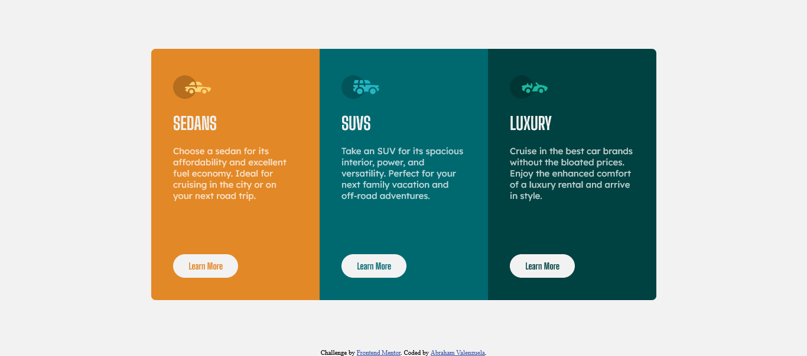

# Frontend Mentor - 3-column preview card component solution

This is a solution to the [3-column preview card component challenge on Frontend Mentor](https://www.frontendmentor.io/challenges/3column-preview-card-component-pH92eAR2-). Frontend Mentor challenges help you improve your coding skills by building realistic projects.

## Table of contents

  - [The challenge](#the-challenge)
  - [Screenshot](#screenshot)
  - [Links](#links)
  - [Built with](#built-with)
  - [What I learned](#what-i-learned)
  - [Useful resources](#useful-resources)
- [Author](#author)


### The challenge

Users should be able to:

- View the optimal layout depending on their device's screen size
- See hover states for interactive elements

### Screenshot



### Links

- Solution URL: [https://github.com/abraham098/3-column-peview-card](https://github.com/abraham098/3-column-peview-card)
- Live Site URL: [https://abraham098.github.io/3-column-peview-card/](https://abraham098.github.io/3-column-peview-card/)


### Built with

- Semantic HTML5 markup
- CSS custom properties
- Flexbox


### What I learned

I learned how to use flex-box a little better.

```css
.wrapper{
  display: flex;
  justify-content: center;
  margin:5.5em auto;
  width: 90%;
  border-radius: 0.5em
}
```

### Useful resources

- [Resource 1](https://courses.kevinpowell.co/view/courses/conquering-responsive-layouts) - I think Kevin is a great teacher, I learned a lot about responsive layouts with him.


## Author

- Frontend Mentor - [@abraham098](https://www.frontendmentor.io/profile/abraham098)
- Twitter - [@Abrahamval098](https://twitter.com/Abrahamval098)
